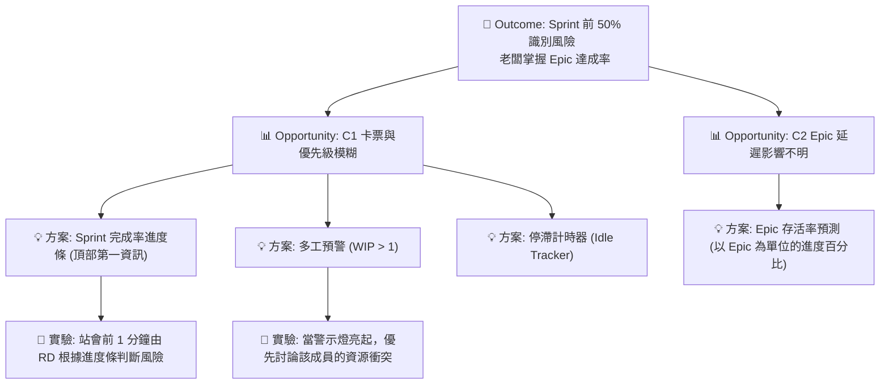

收到！既然我們已經鎖定將 **「Sprint 完成率進度條」** 作為突破口，並優先解決 **Opportunity C1（卡票與優先級模糊）** 的問題，這份經過精煉、具備行動指南的 OST 報告如下：

---

# 🧩 機會解決方案樹（OST）報告 — Step 2

## 1. Outcome（期望改善的狀態）

* **核心目標**：Sprint 前 50% 時間內，開發團隊能同步識別風險。
* **行為改變**：工程師（Andy/Bob）能根據「完成率」自發意識到進度偏差，並在站會中主動討論「因多工而卡住」的任務。
* **老闆視角**：透過頂部資訊掌握進度大局，降低資訊焦慮。

---

## 2. Opportunity Clusters（機會分群）

### Cluster C：站會的「溝通觸發點」

* **Opportunity C1：任務切換導致的「卡票」缺乏定義與共識**
* *現況*：工程師常被「不具共識的急件」插單，導致原任務擱置。

* **Opportunity C2：缺乏對 Epic 層級影響的直觀預測**
* *現況*：知道落後，但不知道具體是哪個老闆在意的目標（Epic）會跳票。

---

## 3. Solutions（解法空間）

### 🚀 核心方案：Sprint 完成率導航看板（Top Tier Dashboard）

**可視化解法（Dashboard 頂部）**：

* **雙重進度條（The Pulse）**：
* **實際進度**：目前已完成的 Story Points %。
* **理想進度**：基於 Sprint 天數應達成的 %（例如 Day 5 應為 50%）。
* *設計意圖*：當兩者差距大於 15% 時，背景轉為黃色或紅色，作為站會「開場警報」。

**針對 C1 的技術解法（資料加工）**：

* **「多工警示燈 (WIP Alert)」**：
* 從 Google Sheet 抓取狀態為 `In Progress` 的票數，若單人 > 1 張，則在頭像旁顯示警告。
* *邏輯*：強迫團隊討論「哪一張才是真的急」。

* **「停滯計時器 (Idle Tracker)」**：
* 計算單票在同一狀態停留的時間。超過 24 小時則閃爍。

---

## 4. 視覺化架構（Mermaid）

---

## 5. Experiments（驗證方式）

| Opportunity | Solution | 驗證方式 | 成功指標 |
| --- | --- | --- | --- |
| **C1 (卡票)** | **頂部完成率 + 多工預警** | 在接下來的 3 天站會中，強制先看完成率，再處理「紅燈卡票」。 | 站會開始前，RD 能主動說出「這張卡住了，因為我去做那張...」。 |
| **C1 (優先級)** | **緊急插單對決** | 在 Dashboard 旁邊標註：「插單必須換掉原本的一張票」。 | WIP 數量穩定保持在 1 左右。 |

---

## 6. 後續建議

* **優先開發**：先將 Google Sheet 中的 `Status` 資料轉換成 **「實際完成率 vs. 時間應達率」**，這是所有討論的基礎。
* **心理建設**：對 Andy 和 Bob 強調「紅燈預警」不是為了責備進度慢，而是為了**「擋掉不合理的插單」**。
* **定義「急」**：利用 Dashboard 的視覺空間，放上一個簡單的優先級矩陣（Priority Matrix），讓全團隊對「什麼是真的急」達成共識。

---

**下一步建議：**
這份報告已經可以作為你與團隊溝通的藍圖。你需要我幫你**具體撰寫給工程師看的「資料邏輯邏輯（公式）」**（例如：如何在 Google Sheet 計算那個理想進度條），還是要幫你**擬定一份跟老闆 Emily 溝通這份 Dashboard 價值的說詞**？