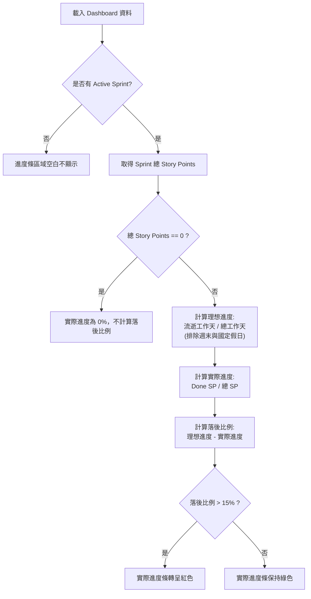
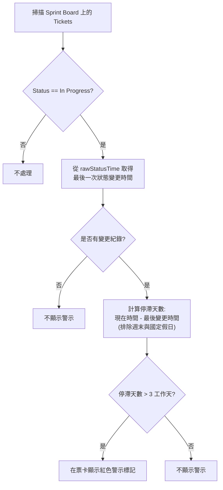

# SPEC-001-Sprint 健康度視覺化與風險預警 - Feature Spec

## 功能概述

### 需求背景
（引用自 `docs/lab-jugg-example/from-skills-step1-painpoints-analysis.md`）
整個團隊在 Sprint 執行過程中缺乏直觀的全局視角，導致：
- 開發者常在 Sprint 末期趕工加班，淪為「解票機器」。
- 每日站會流於形式，通常要在 Sprint 後期才發現風險與阻礙。
- 無法評估臨時插單對整體 Roadmap 中長期目標的衝擊。

### 功能描述
在 Dashboard 提供「Sprint 雙重進度條（宏觀預警）」與「停滯票標記（個體風險）」視覺化，幫助團隊直觀對齊目前進度與插單衝擊，及時發現並排除開發阻礙。

### 預期影響
- **使用者影響**：工程師能聚焦落後原因並有底氣拒絕不合理的插單；Scrum Master/PM 站會能直接針對停滯票尋求阻礙排除。
- **業務影響**：提高 Sprint 承諾達成率，確保產品 Roadmap 推進不被插單完全打亂。
- **技術影響**：需整合 `rawData`、`GetJiraSprintValues` 及 `rawStatusTime`，擴充 Assignee 欄位，並實作排除假日/週末的工作天計算及 5 分鐘快取機制。

---

## 用戶故事 (User Story)

（引用自 `docs/lab-jugg-example/from-skills-step3-user-story.md`，不改寫）

### Story 1: B1 雙重進度條的宏觀預警 (The Pacing Bar)
> **As a** 正在參加 Daily Standup 的開發工程師（Andy/Bob）
> **I want** 在 Dashboard 頂端同時看到「Sprint 理想應達成進度」與「目前實際累積完成進度」的對比，並且當落後超過安全閾值時（如 15%）進度條會轉為紅色警示，
> **So that** 我能立刻意識到整個團隊或我個人的進度已經嚴重落後，進而在站會中聚焦討論落後的原因，並更有底氣地拒絕臨時的插單。

### Story 2: B2 停滯票的個體風險識別 (Idle Tracker)
> **As a** 正在參加 Daily Standup 的 Scrum Master 或開發工程師
> **I want** 讓 Jira 上狀態為 `In Progress` 超過「設定的停滯時間（預設為 3 個工作天）」沒有任何進展的 Ticket，在看板上顯示明顯的紅色警示或閃爍效果，
> **So that** 我能在站會指著那張「停滯的票」直接尋求技術支援或說明阻礙，不再把時間浪費在流水帳的工作回報上，進而縮短單一任務的 Cycle Time。

---

## Acceptance Criteria (驗收標準)

（引用自 `docs/lab-jugg-example/from-skills-step4-acceptance-criteria.md`，不新增）

### Story 1: The Pacing Bar
- **AC01**: 團隊整體進度條正常顯示（理想進度 vs 實際完成比例）。
- **AC02/AC03**: 落後未超過閾值顯示綠色；落後超過閾值（15%）轉紅；超前持平為綠。
- **AC04**: 可切換為特定 Assignee 的個人進度（依賴新增的 Assignee 欄位）。
- **AC05**: 若 Sprint 總 Story Points 為零，實際進度條顯示 0%，不計算落後比例。
- **AC06**: 無 Active Sprint 時隱藏不顯示。
- **AC07**: 理想進度時間推移需排除週末。

### Story 2: Idle Tracker
- **AC08/AC09**: Ticket 在 In Progress 狀態超過 3 個工作天顯示紅色警示；未滿則無警示。
- **AC10**: 停滯票狀態變更後，警示立即消失。
- **AC11/AC12**: 停滯時間計算需排除週末及台灣國定假日。
- **AC13**: 若無狀態變更紀錄，無法判斷停滯時間則不顯示警示。

*(完整 Gherkin 驗收測試場景詳見 `docs/lab-jugg-example/from-skills-step4-acceptance-criteria.md`)*

---

## 產品規格

### 功能邊界
- **包含範圍 (Scope)**：
  - 前端：Dashboard 雙重進度條渲染與 Ticket 狀態警示標記。
  - 後端/資料：整合 Spreadsheet 或 DB (`rawData`, `GetJiraSprintValues`, `rawStatusTime`)；實作排除週期（週末、台灣假日）的計算邏輯；建立 5 分鐘快取機制。
- **不包含範圍 (Out-of-Scope)**：
  - 參數配置：V1 將安全閾值固定為 15%、停滯時間固定為 3 個工作天，不提供 UI 設定介面。
  - 歷史報表：僅針對 Active Sprint 進行計算與顯示，不儲存並回溯過往的歷史 Sprint 表現。

### 業務邏輯
- **日曆與工作天計算**：遇到週末（週六、日）與台灣人事行政總處公告之國定假日，均不列入流逝天數計算。
- **The Pacing Bar 預警判斷**：
  - 實際進度 = (Status Category 為 Done 的 Story Points / 總 Story Points) * 100%。
  - 落後比例 = (理想進度 - 實際進度)。若落後比例 > 15%，觸發紅色警示狀態。
- **Idle Tracker 預警判斷**：
  - Timestamp 比較：現在時間與 `rawStatusTime` 中最後一次進入 `In Progress` 的時間差，換算為工作天數（去頭去尾排除假日）> 3 天，則標記。

### 業務邏輯流程圖（Mermaid）

#### 1. The Pacing Bar (雙重進度條) 判斷邏輯

#### 2. Idle Tracker (停滯票警示) 判斷邏輯

### 相關文件
- [Step 1 痛點分析報告](./from-skills-step1-painpoints-analysis.md)
- [Step 3 用戶故事拆解](./from-skills-step3-user-story.md)
- [Step 4 驗收標準與 AC](./from-skills-step4-acceptance-criteria.md)

---

## 成效追蹤
- **核心指標 1**：Sprint 承諾達成率（Sprint 結束時 Done 的 Story Points 比例是否逐步提升）。
- **核心指標 2**：Ticket 停滯時間（In Progress 的平均 Cycle Time 是否下降）。
- **觀察指標 3**：站會發現並處理 Block 障礙的提早天數。

---

## 變更記錄
| 版本 | 日期 | 作者 | 變更內容 |
|------|------|------|----------|
| v0.1 | 2026-02-25 | AI Assistant | 初版 PRD 草稿產出 |
