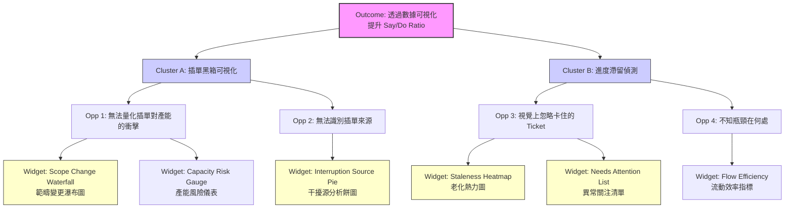

# 🧩 機會解決方案樹（OST）報告 — Step 2 (SaaS Product Version)

## **1. Outcome（產品期望帶來的成效）**

**協助用戶提升 Sprint 交付承諾的達成率（Empower Users to Increase Say/Do Ratio）**
*產品指標：使用你的 Dashboard 的團隊，其 Sprint Completion Rate 提升，且 Unplanned Work 佔比透明化。*

-----

## **2. Opportunities（用戶痛點轉化為產品機會）**

這裡的機會點不變（用戶問題是一樣的），但解讀角度轉向「工具缺失」。

### **Cluster A：插單黑箱（The "Scope Creep" Visibility Gap）**

  * **Opportunity 1：** 用戶在 Sprint 結束前，無法量化「進度是被插單拖累的」。
      * *痛點：Jira 原生 Burndown 混在一起，看不出哪些是後來加的。*
  * **Opportunity 2：** 用戶無法識別「誰是干擾源」與「干擾類型」。
      * *痛點：缺乏針對 Ticket 來源的統計視圖。*

### **Cluster B：流動停滯（The "Stagnation" Blind Spot）**

  * **Opportunity 3：** 用戶在 Daily Standup 時，一眼看不出哪些 Ticket 已經「過期/卡死」。
      * *痛點：Jira 看板缺乏強烈的視覺警示（Visual Decay）。*
  * **Opportunity 4：** 用戶無法判斷當前的瓶頸是「人」還是「流程階段」。
      * *痛點：不知道是 Code Review 太慢，還是某個人太忙。*

-----

## **3. Solutions（Dashboard 功能解法空間）**

這裡我們將解法轉化為具體的 **Dashboard Widgets（小工具）** 或 **Feature Modules（功能模組）**。

### **Opportunity 1 & 2 → 針對「插單可視化」的功能設計**

  * **Solution 1.1（Visualization）：Sprint Scope Change Waterfall（範疇變更瀑布圖）**
      * *功能描述：* 一個動態圖表，左邊是 Sprint Start 的承諾點數，右邊是 End 點數。中間用紅色 Bar 顯示「+ Added Work」，綠色 Bar 顯示「- Removed Work」。
      * *解決什麼：* 讓「插單吃掉產能」這件事一眼就能被看見，不再需要解釋。
  * **Solution 1.2（Analytics）：Interruption Breakdown Pie（干擾源分析餅圖）**
      * *功能描述：* 自動抓取 Sprint 啟動後才建立的 Ticket，並依據 `Reporter`（來源）或 `Label`（類型）自動分類。
      * *解決什麼：* 讓 PM 秒懂是「老闆」插單多，還是「線上 Bug」多。
  * **Solution 1.3（Alerting）：Capacity Risk Gauge（產能風險儀表板）**
      * *功能描述：* 設定團隊平均 Velocity（如 50 點）。當（已規劃 + 插單）總數超過 50 點時，儀表板指針變紅並發出警示：「Capacity Overloaded by 20%」。

### **Opportunity 3 & 4 → 針對「滯留偵測」的功能設計**

  * **Solution 3.1（Visualization）：Staleness Heatmap（卡片老化熱力圖）**
      * *功能描述：* 將看板的 Column 加上熱力背景色。若某張卡在 "Code Review" 停留超過 3 天，背景逐漸變深紅。
      * *解決什麼：* 解決「視覺看不出來」的問題，強制眼球關注紅色區域。
  * **Solution 3.2（Metric）：Flow Efficiency Widget（流動效率小工具）**
      * *功能描述：* 計算 `Active Time / (Active + Wait Time)`。直接顯示：「這個 Sprint 的卡片有 60% 時間都在等待」。
      * *解決什麼：* 用數據證明流程阻塞。
  * **Solution 3.3（List View）：The "Needs Attention" Focus List（關注清單）**
      * *功能描述：* 不顯示所有 Ticket，只列出「高風險」項目（如：停留 \> 3天、沒有 Assignee、Flagged with Blocker）。
      * *解決什麼：* 讓 Standup 變成只討論這份清單，提升效率。

-----

## **4. Experiments（產品原型的驗證方式）**

作為產品設計者，我們要驗證的是「這些圖表是否真的能幫助用戶發現問題」。

  * **Experiment A（Mockup Test）：Scope Change Waterfall 的易讀性測試**
      * **方式：** 拿著 Solution 1.1 的靜態設計稿（Figma），去訪談 5 位 PM。
      * **情境：** 「請告訴我，這個 Sprint 為什麼沒做完？」
      * **指標：** 用戶能否在 5 秒內指著紅色 Bar 說：「因為這週插單了 15 點。」
  * **Experiment B（Data Simulation）：老化熱力圖的感受測試**
      * **方式：** 拿一張普通的 Jira 看板截圖 vs. 加上 Solution 3.1 熱力圖的截圖。
      * **提問：** 「如果現在是站會，你第一眼會想討論哪一張卡片？」
      * **指標：** 確認用戶的視線是否被引導到「卡最久」的那張卡上。

-----

## **5. Visualized Version（Mermaid 樹狀圖 - Product View）**

