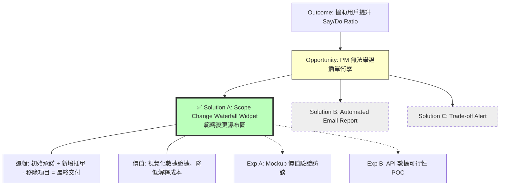

# 🧩 機會解決方案樹（OST）報告 — Step 2 (Selected Strategy Version)

## **1. Outcome（產品期望帶來的成效）**

**協助用戶提升 Sprint 交付承諾的達成率（Empower Users to Increase Say/Do Ratio）**
*定義：透過數據可視化工具，協助 PM/Lead 識別並證明範疇變更（Scope Creep）對 Sprint 承諾的影響。*

-----

## **2. Opportunities（未被滿足的需求 / 痛點機會）**

經過分析，我們將資源集中在最具價值的機會點：

### **Target Opportunity：PM 無法舉證「插單」對進度的具體衝擊**

  * **痛點情境：** 在 Sprint Review 或進度會議上，老闆質疑「為什麼承諾的沒做完？」。PM 知道是因為中途插了急件，但缺乏直觀的數據圖表來證明「我們其實做了很多事（只是不在原本計畫內）」。
  * **核心障礙：** Jira 原生的 Burn-down Chart 無法區分「計畫內」與「插單」的工作量，導致團隊看起來像是效率不彰。

-----

## **3. Solutions（解法空間與策略選擇）**

針對上述機會點，我們評估了以下解法，並選定 Solution A 為優先開發項目。

### **✅ Solution A：Scope Change Waterfall Widget（範疇變更瀑布圖） `[已選定策略 / Selected Strategy]`**

這是一個動態圖表模組，專門用於解決「解釋成本過高」的問題。

  * **核心概念（Concept）：**
    將 Sprint 的點數變化拆解為「加減數學題」，讓變動一目了然。

  * **視覺邏輯詳解（Visual Logic）：**
    圖表由左至右包含四個關鍵區塊：

    1.  **初始承諾（Original Commitment）**：Sprint 開始當下的總點數（基準線）。
    2.  **新增插單（Scope Added）**：用 **紅色** 顯示 Sprint 期間「額外增加」的點數（罪魁禍首）。
    3.  **移除項目（Scope Removed）**：用 **黃色** 顯示為了救火而「移出」的點數（代價交換）。
    4.  **最終狀態（Final State）**：顯示最終實際交付的點數 vs. 剩餘未完成的缺口。

  * **解決什麼問題（Value）：**

      * **證據化：** 將口頭的「插單很多」轉化為「數據顯示增加了 30% 負載」。
      * **歸因明確：** 透過點擊紅色區塊，可直接查看插單來源（是誰插的？），讓檢討有所依據。

-----

### **(其他備選解法 - 暫列為 Backlog)**

  * **Solution B：Automated Sprint Analysis Email**
      * *概念：* Sprint 結束後自動寄送插單統計報告給利害關係人。
      * *狀態：* 暫緩（次要優先級）。
  * **Solution C：Trade-off Negotiator Alert**
      * *概念：* 當插單發生時，系統強制彈出視窗要求 PM 進行交換確認。
      * *狀態：* 暫緩（介入性太強，開發成本高）。

-----

## **4. Experiments（驗證方式）**

既然選定了 **Solution A**，我們的驗證實驗將全數圍繞此解法展開，確保我們在寫程式碼之前，這個設計是對的。

  * **Experiment A：Mockup 價值驗證（Solution Evaluation）**

      * **目的：** 確認 PM 看到這張瀑布圖時，是否認為它能解決「向老闆解釋」的痛苦。
      * **方法：** 製作 Solution A 的高保真 Mockup（包含極具張力的紅色插單柱狀），對 5 位 PM 進行訪談。
      * **關鍵提問：** 「如果在上次進度落後的檢討會上你有這張圖，結果會有什麼不同？」
      * **成功標準：** 用戶表示「這張圖能幫我節省解釋時間」或「這正是我缺少的證據」。

  * **Experiment B：數據可行性 POC（Feasibility Test）**

      * **目的：** 確認我們能否透過 Jira API 準確重現「過去 Sprint」的變更歷程。
      * **方法：** 工程師手動撈取 API 資料，試算一個已結束 Sprint 的 `Original` vs `Added` 點數，看是否與 PM 的記憶相符。

-----

## **5. Visualized Version（Mermaid 樹狀圖）**

-----