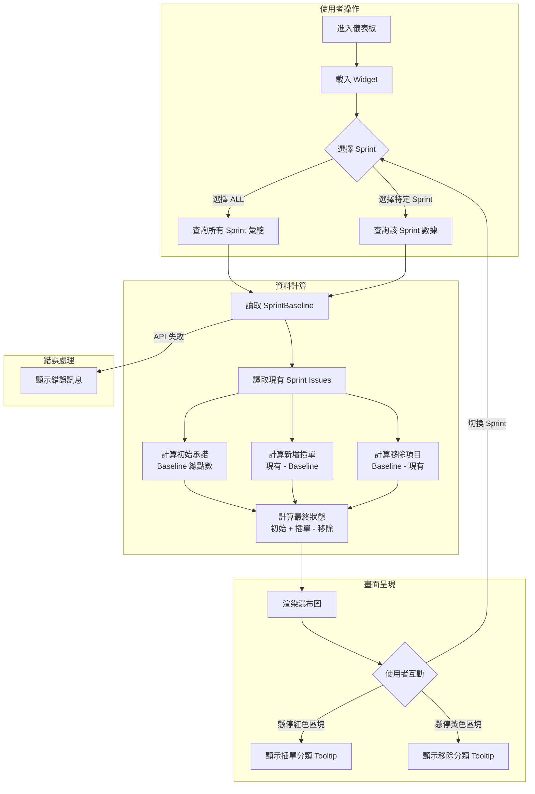

# SPEC-002-ScopeChangeWaterfallWidget - Feature Spec

## 📝 功能概述

### 需求背景

**痛點來源**：根據痛點分析（Step 1），團隊雖然在 Jira 記錄了所有工作，但缺乏對「插單影響（Unplanned Work）」的量化可視性。Jira 原生的 Burn-down Chart 過於粗略，無法區分「計畫內工作」與「插單工作」的比例，導致：

- PM 在 Sprint Review 會議中被質疑「為什麼承諾的沒做完？」時，缺乏直觀的數據圖表來證明團隊的實際工作量
- 團隊看起來像是效率不彰，但實際上是產能被插單稀釋

**機會點**（OST Step 2）：PM 無法舉證「插單」對進度的具體衝擊

**選定解法**：Scope Change Waterfall Widget（範疇變更瀑布圖）— 將 Sprint 的點數變化拆解為「加減數學題」，讓變動一目了然。

### 功能描述

提供一個動態瀑布圖 Widget，讓 PM 能在儀表板上直觀呈現 Sprint 期間的範疇變動，包含「初始承諾」、「新增插單」、「移除項目」與「最終狀態」四個區塊，並支援依 Issue Type 分類的 Tooltip 明細與跨 Sprint 切換功能。

### 預期影響

| 面向 | 影響 |
|------|------|
| **使用者影響** | PM 可在會議中用一張圖證明工作量變化，減少口頭解釋的時間與誤解；Scrum Master 與 Tech Lead 可快速掌握 Sprint 健康度 |
| **業務影響** | 將口頭的「插單很多」轉化為「數據顯示增加了 X% 負載」，讓檢討有所依據，促進源頭管理 |
| **技術影響** | 需新增 SprintBaseline 資料表以支援初始承諾的快照；需開發計算邏輯與前端瀑布圖元件 |

---

## 📋 用戶故事 (User Story)

### Story 1：檢視 Sprint 範疇變動全貌 (The Overview)

* **As a** PM (Product Manager),
* **I want to** 在儀表板上看到一張由「初始承諾」、「新增插單」、「移除項目」與「最終狀態」組成的瀑布圖,
* **So that** 我能在 Sprint Review 會議中，用一張圖證明我們的工作量變化，而不只是口頭解釋。

### Story 2：分析插單來源與類型 (The Drill-down)

* **As a** PM,
* **I want to** 點擊或懸停在「新增插單（Scope Added）」的紅色區塊時，看到依「Ticket Type（Bug vs. Feature）」分類的點數統計,
* **So that** 我能當場向利害關係人證明，進度落後是因為處理突發的 Bug（償還技術債）還是因為臨時追加的新功能。

### Story 3：展示交換與取捨的代價 (The Trade-off)

* **As a** PM,
* **I want to** 清晰呈現「移除項目（Scope Removed）」的總點數（黃色區塊）,
* **So that** 我能證明團隊有進行積極的優先級管理（Trade-off），而沒有無視資源限制盲目承接工作。

### Story 4：切換不同 Sprint 的歷史數據 (Context Switching)

* **As a** PM,
* **I want to** 在 Widget 上透過下拉選單快速切換不同的 Sprint（包含進行中與已結束的）,
* **So that** 我不僅能報告當前進度，還能快速回顧上一個 Sprint 的慘況來做對比。

---

## ✅ Acceptance Criteria (驗收標準)

### Story 1: The Overview

**AC1-1: 成功顯示瀑布圖** ✅ 正常流程

```gherkin
場景：PM 查看 Sprint 範疇變動瀑布圖
Given 使用者已進入儀表板
And SprintBaseline 已記錄該 Sprint 的初始項目
When 使用者進入 Scope Change Waterfall Widget
Then 系統應顯示瀑布圖，包含：
  | 區塊     | 顏色 | 計算邏輯                              |
  | 初始承諾 | 藍色 | Baseline 總點數                       |
  | 新增插單 | 紅色 | 現在在 Sprint 但不在 Baseline 的總點數 |
  | 移除項目 | 黃色 | 在 Baseline 但現在不在 Sprint 的總點數 |
  | 最終狀態 | 綠色 | 初始承諾 + 新增插單 - 移除項目         |
```

**AC1-2: 空值 Story Points 處理** ⚠️ 邊界條件

```gherkin
場景：Issue 的 Story Points 為空值
Given 某 Issue 的 Story Points 欄位為空
When 系統計算瀑布圖數據
Then 該 Issue 的 Story Points 應視為 0
```

**AC1-3: Sprint 無 Issue 時顯示空狀態** ⚠️ 邊界條件

```gherkin
場景：選定的 Sprint 沒有任何 Issue
Given 該 Sprint 無任何 Issue
When 瀑布圖載入完成
Then 系統應顯示空的瀑布圖（所有區塊數值為 0）
```

### Story 2: The Drill-down

**AC2-1: Tooltip 顯示插單分類統計** ✅ 正常流程

```gherkin
場景：PM 查看新增插單的類型分布
Given 新增插單（紅色區塊）包含多個 Issue
When 使用者懸停在紅色區塊上
Then Tooltip 應顯示：
  | 類型      | 說明                    |
  | Feature   | Story 類型的總點數      |
  | Operation | Task 類型的總點數       |
  | Bug       | Bug 類型的總點數        |
  | 總計      | 所有類型的總點數        |
```

**AC2-2: 無插單時的 Tooltip** ⚠️ 邊界條件

```gherkin
場景：Sprint 沒有新增插單
Given 新增插單點數為 0
When 使用者懸停在紅色區塊上
Then Tooltip 應顯示「無新增項目」
```

### Story 3: The Trade-off

**AC3-1: Tooltip 顯示移除項目統計** ✅ 正常流程

```gherkin
場景：PM 查看移除項目的類型分布
Given 移除項目（黃色區塊）包含多個 Issue
When 使用者懸停在黃色區塊上
Then Tooltip 應顯示：
  | 類型      | 說明                    |
  | Feature   | Story 類型的總點數      |
  | Operation | Task 類型的總點數       |
  | Bug       | Bug 類型的總點數        |
  | 總計      | 所有類型的總點數        |
```

**AC3-2: 無移除項目時的 Tooltip** ⚠️ 邊界條件

```gherkin
場景：Sprint 沒有移除項目
Given 移除項目點數為 0
When 使用者懸停在黃色區塊上
Then Tooltip 應顯示「無移除項目」
```

### Story 4: Context Switching

**AC4-1: Sprint 下拉選單顯示所有 Sprint** ✅ 正常流程

```gherkin
場景：PM 查看 Sprint 下拉選單
Given 使用者進入 Widget
When Widget 載入完成
Then 下拉選單應包含：
  - 「ALL」選項（預設選中）
  - 所有 Sprint（包含 future、active、closed 狀態）
```

**AC4-2: 切換 Sprint 更新瀑布圖** ✅ 正常流程

```gherkin
場景：PM 切換到特定 Sprint
Given 瀑布圖已顯示
When 使用者選擇「Sprint 12」
Then 瀑布圖應更新為 Sprint 12 的數據
```

**AC4-3: 選擇 ALL 顯示彙總數據** ✅ 正常流程

```gherkin
場景：PM 選擇 ALL 查看全部 Sprint 彙總
Given 使用者已選擇某特定 Sprint
When 使用者選擇「ALL」
Then 瀑布圖應顯示所有 Sprint 的加總數據
```

### 通用：錯誤處理

**AC-ERR-1: API 讀取失敗** ❌ 異常情況

```gherkin
場景：API 讀取失敗
Given 使用者進入 Widget
When API 請求失敗
Then 系統應顯示錯誤訊息「資料載入失敗，請稍後再試」
And 不應顯示舊的 cached 資料
```

---

## 🎯 產品規格

### 功能邊界

**包含範圍**
- 瀑布圖 Widget（含四個區塊：初始承諾、新增插單、移除項目、最終狀態）
- Tooltip 互動（顯示 Issue Type 分類統計）
- Sprint 下拉選單（支援 ALL 與個別 Sprint 切換）
- SprintBaseline 資料表（記錄 Sprint 開始時的快照）
- 計算邏輯 API

**不包含範圍**
- 插單的「提出者（Requester）」歸因顯示
- 「移除項目」與「插單」的一對一對應關係
- 靜態報表匯出功能（PDF/Excel）
- 跨 Sprint 的歷史趨勢比較圖

**影響範圍**
- 儀表板頁面（新增 Widget 區塊）
- 資料層（新增 SprintBaseline 表）

### 業務邏輯

**SprintBaseline 資料表結構**

| 欄位 | 類型 | 說明 |
|------|------|------|
| Sprint Name | string | Sprint 名稱 |
| Snapshot Date | date | 快照時間（Sprint startDate） |
| Issue Key | string | 初始分配的 Issue Key |
| Story Points | number | 該 Issue 當時的 Story Points |
| Issue Type | string | Bug / Story / Task |

**計算規則**

| 術語 | 計算方式 |
|------|----------|
| **初始承諾** | SprintBaseline 中該 Sprint 所有 Issue 的 Story Points 總和 |
| **新增插單** | 現在在 Sprint 中，但不在 SprintBaseline 中的 Issue 總點數 |
| **移除項目** | 在 SprintBaseline 中，但現在不在 Sprint 中的 Issue 總點數 |
| **最終狀態** | 初始承諾 + 新增插單 - 移除項目 |

**Issue Type 分類對應**

| Issue Type | 分類名稱 |
|------------|----------|
| Story | Feature |
| Task | Operation |
| Bug | Bug |

**空值處理**
- Story Points 為空值時，視為 0

### 業務邏輯流程圖



### 相關文件

| 文件 | 說明 |
|------|------|
| [step1-painpoints-analysis.md](../docs/reference/step1-painpoints-analysis.md) | 痛點分析報告 |
| [step2-ost-v2-focus.md](../docs/reference/step2-ost-v2-focus.md) | 機會解決方案樹（OST）報告 |
| [step3-userstory-v1.md](../docs/reference/step3-userstory-v1.md) | User Story 套件 |
| [step4-ac-scope-change-waterfall-v1.md](../docs/reference/step4-ac-scope-change-waterfall-v1.md) | Acceptance Criteria |
| [table-schema.md](../docs/table-schema.md) | 資料表架構說明 |
| [tech-overview.md](../docs/tech-overview.md) | 技術架構概覽 |

---

## 📊 成效追蹤

### 核心追蹤指標

| 指標 | 定義 | 目標 |
|------|------|------|
| **Widget 使用率** | 每週進入 Widget 的不重複使用者數 | 所有 PM 至少每週使用 1 次 |
| **會議引用率** | Sprint Review 中使用此圖表的比例 | > 80% 的會議有引用 |

### 觀察指標

| 指標 | 定義 |
|------|------|
| **解釋時間縮短** | PM 回報在會議中解釋進度落後原因所需時間是否減少 |
| **插單來源識別** | 團隊是否能依據數據識別主要插單類型並採取改善行動 |

---

## 📝 變更記錄

| 版本 | 日期 | 變更內容 | 作者 |
|------|------|----------|------|
| v1.0 | 2025-12-06 | 初版 PRD Draft | *AI 生成* |
